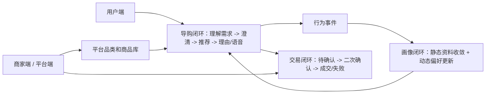
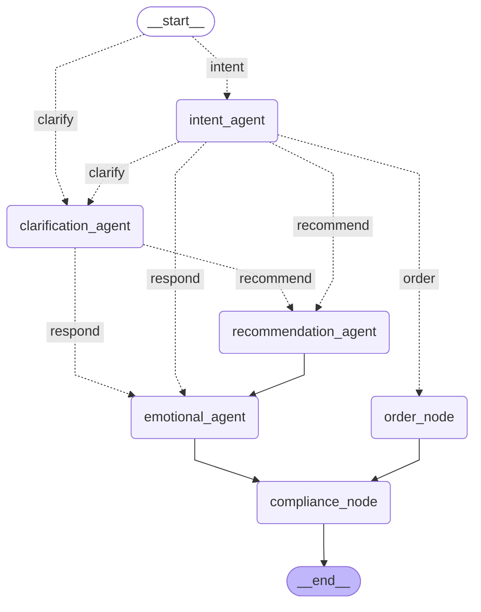
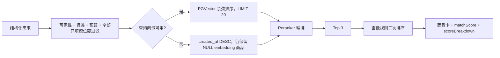
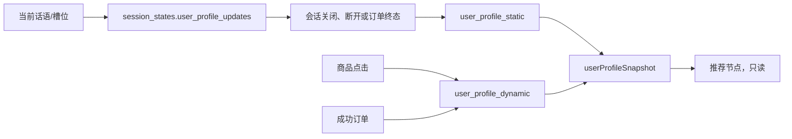

# 语音导购 Agent 架构文档

本文描述当前仓库已经落地的系统架构和关键设计决策。实现以 FastAPI 模块化单体为核心，Agent 工作流由 LangGraph 装配，三个 Vue 前端通过 HTTP 和双 WebSocket 访问后端。

## 1. 架构总览

### 1.1 物理结构

```text
apps/
  api/             FastAPI、LangGraph、订单/画像/品类业务、双 WebSocket
  user-web/        用户端 Vue 应用
  merchant-web/    商家端 Vue 应用
  platform-web/    平台端 Vue 应用
packages/web-ui/   三端共享组件、样式、API 类型和请求客户端
sql/               PostgreSQL + PGVector Schema 和演示数据
docs/              需求、架构和实现说明
```

后端是模块化单体，不拆分微服务。HTTP 路由按 `catalog`、`orders`、`merchant`、`platform`、`sessions` 划分；Agent 代码、模型适配、实时传输和基础设施分别位于 `agents`、`core`、`realtime` 和对应模块中。

### 1.2 三个业务闭环



用户输入进入同一会话的两个传输通道：文本通道负责结构化事件和文本增量，音频通道负责 ASR 上行与 TTS 下行。两条通道用 `sessionId + turnId` 关联，但音频二进制不进入文本事件重放日志。

## 2. 业务架构

### 2.1 端和模块边界

| 边界 | 主要职责 | 数据边界 |
| --- | --- | --- |
| 用户端 | 浏览、导购、行为上报、订单操作 | 只能访问启用商家和用户自己的订单 |
| 商家端 | 店铺、商品、库存和本店订单 | SQL 以 `owner_user_id` 隔离 |
| 平台端 | 品类、槽位、商家状态、全量数据 | 当前 POC 没有独立认证中间件，产品化时需补角色授权 |
| catalog | 可见商品、行为事件、静态/动态画像 | 商品可见性和画像更新在服务端判断 |
| agents | 工作流、状态、模型调用、推荐和回复 | 业务事实通过运行时依赖注入，不由 Agent 直接建立数据库连接 |
| orders | 待确认订单、确认事务、取消和失败状态 | 订单快照是成交事实，和当前商品字段解耦 |
| sessions | 会话消息、状态投影、静态画像收敛 | 只持久化业务事实，不把整份图状态当业务表使用 |
| realtime | 连接集合、会话锁、事件广播、文本重放、TTS 转发 | 文本事件保留，音频二进制不保留 |

### 2.2 业务可见性

用户侧商品查询和推荐共同使用以下可见性条件：商品未软删除、状态为 `on_sale`、库存大于 0、商家未软删除且已启用。商家和平台列表可以看到更宽的数据范围，但仍排除软删除记录。订单通过用户、商家 owner 或平台查询边界隔离。

## 3. 技术架构

| 能力 | 选型 |
| --- | --- |
| API | FastAPI + SQLAlchemy asyncio + asyncpg |
| 工作流 | LangGraph `StateGraph`，Agent 节点和普通业务节点统一装配 |
| 模型封装 | LangChain `ChatQwen`、DashScope Embedding、DashScope Rerank |
| Agent LLM | `qwen3.7-flash` |
| Embedding | `qwen3.7-text-embedding`，商品向量 1024 维且入库前归一化 |
| Reranker | `qwen3-rerank` |
| ASR | `qwen-audio-3.0-asr-flash-streaming` |
| TTS | `qwen-audio-3.0-tts-plus` |
| 数据库 | PostgreSQL + PGVector、JSONB、数组、部分索引 |
| 缓存/重放 | Redis 版本化目录列表缓存和事件列表；进程内 deque 作为事件热缓存 |
| 前端 | 三个独立 Vue 应用 + `packages/web-ui` 共享包 |
| 可观测性 | LangSmith，可选启用，失败不阻断业务请求 |

模型密钥通过配置决定是否启用模型链路。未配置 DashScope Key 时，意图、槽位解析、排序、推荐理由和部分语音输出使用确定性降级；服务端 ASR 输入仍需要可用的 ASR 模型，TTS 失败时前端使用浏览器语音播放。

## 4. LangGraph 工作流

### 4.1 图装配和路由

`agents/graph.py` 只负责声明节点、边和条件路由，业务规则放在各节点模块。下图 Mermaid 源码由已编译的 LangGraph 工作流直接生成，使用的命令为：

```powershell
uv run --project apps/api python -c "from voice_shopping_api.agents.graph import build_workflow; print(build_workflow().get_graph().draw_mermaid())"
```

当前图为：



条件边的标签对应图中的路由键；各键与业务条件的对应关系在 `_route_start`、`_route_intent` 和 `_route_clarification` 中定义。

节点职责如下：

| 节点 | 输入重点 | 输出重点 |
| --- | --- | --- |
| `intent_agent` | 当前话语、最近 6 条消息、动态品类上下文、上一轮卡片/待确认订单 | 单意图、置信度、品类、订单 action、品类变化标记 |
| `clarification_agent` | 品类必填/允许槽位、槽位定义、当前槽位、pending question、当前话语 | `ASK/READY`、过滤后的槽位、缺失槽位、下一问题 |
| `recommendation_agent` | 意图、品类、已填槽位、画像快照、注入的 catalog loader | Top 3 商品卡、匹配分、评分拆解、情绪风格 |
| `order_node` | 意图 action、上一轮商品卡、待确认订单 | 订单服务返回的状态和播报文本 |
| `emotional_agent` | 商品卡、原话、情绪风格 | 每卡理由、完整话术，不直接发布 |
| `compliance_node` | 完整话术和发布器 | 按短句检查、违规兜底，并发布安全文本增量和 TTS 短句 |

订单处理节点和推荐/回复节点都可以运行普通 Python 业务代码；Agent 不直接互相调用，而是通过共享 `ShoppingState` 和图路由协作。

### 4.2 状态生命周期

`agents/state.py` 使用一个扁平 `ShoppingState`，通过 TypedDict mixin 标注字段生命周期。图装配显式声明三类 LangGraph schema：

- `ShoppingInputState`（`input_schema`）：接收当前话语、会话恢复事实、当前品类 taxonomy 和服务层准备的本轮快照。
- `ShoppingState`（内部 state schema）：包含节点路由、澄清、召回、订单、合规和流式发布所需的完整扁平状态。
- `ShoppingOutputState`（`output_schema`）：只返回本轮对话进度、商品卡、订单结果、合规状态和最终安全回复；taxonomy、候选商品、模型开关、会话元数据和画像快照不会从图输出。

`ShoppingRuntimeDependencies` 作为 `context_schema` 注入数据库召回、订单事务和发布器。无 checkpointer 的多轮调用可以把输出中的 `required_slots`、`allowed_slots`、`slots` 和 `pending_question` 作为下一轮输入；完整 taxonomy 仍由服务层按轮加载。

状态组如下：

| 状态组 | 内容 | 生命周期 |
| --- | --- | --- |
| TurnState | session/turn/user、当前话语、最近历史、模型开关 | 当前轮 |
| ConversationState | 意图、品类、品类变化、当前允许槽位、槽位、澄清问题 | 跨轮业务事实 |
| TaxonomyState | 当前 DB 品类及槽位的只读上下文 | 当前轮，不持久化 |
| ProfileState | 会话内静态画像候选 | 跨轮候选，结束时收敛 |
| RecommendationState | 画像快照、候选商品、商品卡、上一轮卡片 | 画像快照和候选为当前轮；商品卡可跨轮引用 |
| OrderState | 当前待确认或终态订单引用 | 订单表为事实源，状态只保留当前轮结果 |
| ResponseState | 理由、话术、合规和流式标记 | 当前轮展示输出 |

扁平状态是为了避免 StateGraph 默认更新语义下的嵌套对象整体覆盖。每个节点只返回自己负责的局部键，运行时再合并成完整状态；输入和输出 schema 只控制图边界，不改变内部状态合并。

### 4.3 运行时依赖注入

`ShoppingRuntimeDependencies` 通过 LangGraph context 注入：

- `catalog_loader`：由 service 层绑定数据库商品召回和向量查询。
- `order_handler`：由 service 层绑定订单创建/确认/取消事务。
- `reason_publisher`：把逐卡理由增量发送到文本 WebSocket。
- `speech_delta_publisher`：把话术增量发送到文本 WebSocket。
- `speech_sentence_publisher`：把完成短句交给音频 Hub 做 TTS。

这样可以在单元测试中使用内存 catalog、假的订单处理器和内存发布器，也避免 Agent 节点依赖 FastAPI 请求对象。

## 5. 品类、商品和检索架构

### 5.1 动态品类配置

平台品类由 `category_l1`、`category_l2` 和 `category_slots` 组成。二级分类通过外键关联一级分类；槽位保存 `key`、`is_required` 和非空 `enum_values`。运行时 `list_categories()` 从槽位表聚合 `requiredSlots` 和 `optionalSlots`，并将完整配置注入意图和澄清节点。

商品写入时由 API 重新读取当前二级分类的槽位定义，校验一级/二级归属、未知键、必填值、枚举范围和空值。数据库约束负责基本结构，跨表语义由 API 负责。

### 5.2 商品向量

`core/product_embedding.py` 把商品转换成固定顺序的中文商品卡片文本：品类、品牌、卖点、描述、带中文标签的属性和价格带。英文品类/槽位/枚举映射为中文，未知代码回退为原值。

商品创建时生成向量；更新名称、品类、品牌、描述、价格、属性或卖点时按拼装文本变化重新生成；只更新 SKU、库存、状态或图片时保留原向量。模型不可用时写入 `NULL`，不阻断商品 CRUD。平台提供全量向量重建接口。

`products` 上有属性 JSONB GIN 索引、名称 trigram 索引和带 `embedding IS NOT NULL` 谓词的 HNSW 余弦索引。当前推荐召回实际使用向量排序或 `created_at` 降级排序；trigram 索引为后续词法查询保留，Reranker 失败时的当前词法兜底在 Python 中完成。

### 5.3 推荐链路



硬过滤会把所有已经填入的必填和选填槽位都传入 SQL。枚举使用 JSONB 包含语义，布尔值按 JSON 布尔序列化；数值使用最低值比较；尺码支持 `size` 或 `sizeRange`；防水值提取数字部分；商品为 `unisex` 时可满足性别需求。

Reranker 分数先裁剪到 `[0, 1]`，前 20 条取 Top 3；Reranker 不可用时使用关键词命中分 `min(1, 0.52 + 0.1 * 命中数)`。随后只在这 3 条内叠加画像规则：品牌偏好 `+0.2`、价格超过平均客单价 1.5 倍 `-0.15`、最近购买过 `-0.3`。规则分相同则保持第一阶段顺序。

对比和查询优先使用上一轮商品卡；没有商品卡时才进入正常召回路径。商品卡由后端事实构造，理由生成被拆到下一个回复节点。

## 6. 用户画像架构

画像数据拆成两个表和一个会话候选区：



- 静态资料抽取只接受高置信度文本规则和可信 `profile` 渠道；无效值被丢弃，空值不覆盖旧值。
- 显式 profile patch 在合并顺序上覆盖对话抽取结果。
- 动态画像更新锁定用户和画像行，点击权重为 `0.1`，成功订单权重为 `0.32`，分数封顶为 `1.0`；最近浏览/购买列表去重并限制 20 条。
- 成功订单后重新计算用户全部成功订单的平均客单价。
- 推荐前读取静态和动态画像形成只读快照；快照、候选商品和生成文本不写入业务状态投影。

## 7. 订单事务架构

订单服务使用数据库事务和行锁保证语音与 HTTP 两种入口行为一致：

1. 创建待确认订单时校验商品可售、商家启用和库存，保存价格、商家和商品快照，不扣库存。
2. 确认时先锁订单，再锁商品和商家；重新校验有效期、可售状态、价格和库存。
3. 成功路径在同一事务中扣减库存、更新订单为 `success`、设置确认时间并更新动态画像。
4. 失败路径更新为 `fail` 并写入原因；取消只处理用户自己的 `pending` 订单。
5. 数据库触发器禁止 `success`/`fail` 终态重新迁移；唯一幂等键保证重复创建不产生第二个订单。

订单成交快照保存在 `orders.merchant_snapshot` 和 `orders.product_snapshot`，因此商品软删除、改价或商家状态变化不会改变历史订单展示。

## 8. 会话持久化和并发

### 8.1 两层状态存储

LangGraph Checkpointer 和业务状态投影各自承担不同职责：

- Checkpointer：可选的 PostgreSQL `AsyncPostgresSaver`，懒加载并持久化完整 StateGraph 状态；`configurable.thread_id` 使用 `stable_uuid(session_key)`。
- `session_states.business_state`：每轮只保存业务侧需要查询、审计或在无 checkpoint 时引导下一轮的投影。当前版本的键为 `product_category`、`slots`、`user_profile_updates`、`pending_question`、`product_cards`，版本号为 `1`。
- 下一轮优先从 Checkpointer 恢复；没有 checkpoint 时读取 `session_states` 最新投影，并通过 `carry_forward_state()` 丢弃未知或过期字段。
- 待确认订单从 `orders` 查询，完整订单详情不依赖图状态；画像快照、候选商品、模型开关、回复文本不跨轮持久化。
- `session_messages` 每轮保存用户 transcript 和助手最终回复，按 `(session_id, turn_id, seq)` 幂等写入。

### 8.2 会话串行化

`RealtimeHub` 为每个 session 使用 `asyncio.Lock`，串行执行同一会话的 turn，避免并发轮次覆盖状态、重复创建订单或交错发布事件。文本和音频连接关闭后，只有当该 session 没有任何连接时才触发一次断开画像收敛。

## 9. 双 WebSocket 和重连

### 9.1 文本通道

`/ws/text/{session_id}` 负责结构化事件。服务端先发送 `session.connected`，处理轮次时发送初始 `flow.status`，然后从 LangGraph `tasks` 流监听节点开始事件，因此前端显示的是实际运行中的节点。文本事件包括：

- `flow.status`：processing/completed，processing 时可带 node 和用户提示 label。
- `recommendation.cards`：商品卡和情绪风格。
- `text.delta`：理由或完整话术增量。
- `text.completed`：最终文本和合规标记。
- `order.updated`：订单状态。
- `flow.error`：当前轮错误。

每个 session 在进程内保留 300 条事件，同时写入 Redis 列表 `voice-shopping:events:{sessionId}`，限制 300 条并设置 3600 秒 TTL。`session.resume` 根据 `turnId` 和 `afterSeq` 重放文本事件。

### 9.2 音频通道

`/ws/audio/{session_id}` 负责两条方向：

- 输入：客户端将浏览器采集的音频重采样为 16 kHz PCM16，通过 `audio.start`、二进制帧和 `audio.commit` 发送；ASR 回调按标点拆出 `asr.sentence`，提交时发送 `asr.completed`。
- 输出：情感节点把完整话术按标点切成短句，Hub 为每句调用 TTS，发送 `audio.start`、WAV 分片、`audio.end`，最后发送 `audio.done`。
- TTS 没有返回有效音频时，Hub 发送带 `fallback=true` 的 16 kHz 静音 WAV 控制流程，用户端改用浏览器 `SpeechSynthesis`；ASR 无模型时返回 `audio.error`，不会伪造服务端转写结果。

音频事件不写入 Redis，音频断线只清理连接和当前 ASR 资源；需要重新录音或重新播放时由客户端重新发起。

## 10. 模型、降级和可观测性

### 10.1 降级策略

| 场景 | 当前降级 |
| --- | --- |
| 无 DashScope Key | 意图关键词识别、确定性槽位抽取、created_at 候选排序、词法 Reranker 分、确定性理由 |
| Query Embedding 失败 | SQL 不加向量条件，按 `created_at DESC` 取候选 |
| Reranker 失败 | 使用商品事实文本的词法命中分 |
| 单商品理由模型失败或不合规 | 仅该卡使用固定理由，不影响其他卡 |
| TTS 无音频或失败 | 发送 fallback 标志，前端使用浏览器语音 |
| LangSmith 不可用 | 日志记录调试信息，业务请求继续执行 |

### 10.2 LangSmith

LangSmith 追踪由环境变量可选开启。代码会记录工作流的 session/turn 元数据、模型/Embedding/Reranker 的 provider 和模型名、请求 ID、耗时、Token/计费信息，以及 ASR/TTS 的音频统计。当前实现的模型输入、Embedding 文本、ASR transcript 和 TTS 文本可能进入 trace；生产环境必须在启用外部追踪前增加脱敏、访问控制和保留期限策略。

## 11. 核心数据模型

| 表 | 主要内容 |
| --- | --- |
| `users` | 演示用户、角色和状态 |
| `merchants` | 店铺、owner、启用状态、禁用原因和软删除时间 |
| `category_l1` | 一级品类 |
| `category_l2` | 二级品类及父级外键 |
| `category_slots` | 槽位必填标记和枚举值 |
| `products` | 商家、价格、库存、属性 JSONB、状态、软删除和 1024 维向量 |
| `orders` | 订单状态、快照、价格、幂等键、有效期和失败原因 |
| `sessions` | 会话生命周期和用户归属 |
| `session_states` | 每轮业务状态投影和待确认订单引用 |
| `session_messages` | 每轮用户/助手消息 |
| `user_profile_static` | 静态用户资料 |
| `user_profile_dynamic` | 品类/品牌偏好、最近行为和客单价 |

Redis 保存短期文本事件日志，以及商家、店铺和商品的列表快照。目录缓存 key 带全局
revision，商家/店铺/商品写入或成功扣库存后在数据库提交成功后递增 revision；旧快照通过
TTL 自动清理。Redis 不保存商品库存、订单、画像或会话业务事实，这些始终以 PostgreSQL 为准。

## 12. 当前架构边界

1. 认证、密码登录、角色授权和平台接口保护尚未接入，当前请求头身份只适合本地演示。
2. 品类槽位定义已数据库化，但槽位类型语义仍以枚举数组和应用侧规范为主；新增复杂类型需要扩展 schema、澄清解析和 SQL 匹配器。
3. 向量重建接口同步执行，商品量增长后应改为后台任务并增加失败重试。
4. Redis 重放窗口为 1 小时/300 条，不能替代长期消息审计；音频事件没有断点续播能力。
5. LangSmith 追踪默认 fail-open，但启用生产追踪前必须补充敏感信息治理。
6. `compliance_node` 在同一节点内按完整短句检查话术，命中后替换固定安全回复再发布，原始违规话术不会进入文本或 TTS。
7. 当前版本不包含支付、退款、物流、售后和真实电商平台对接。
