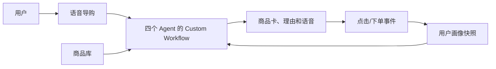
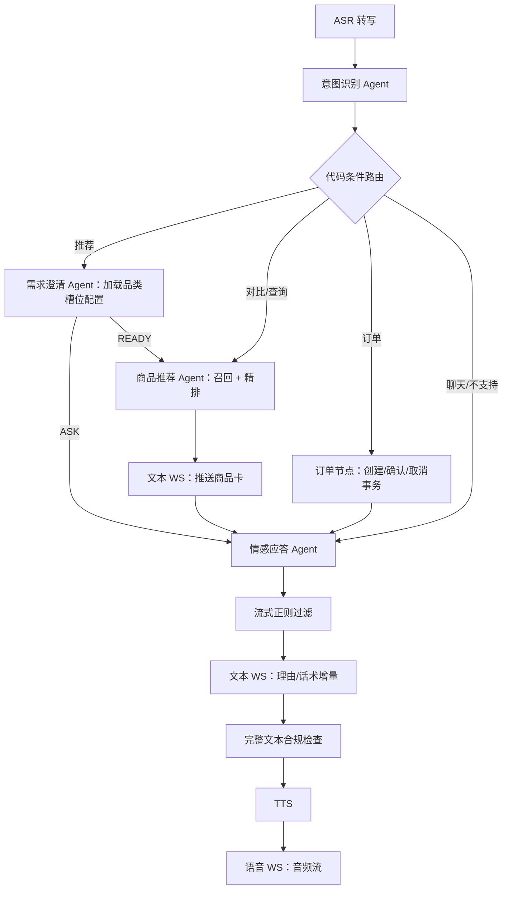
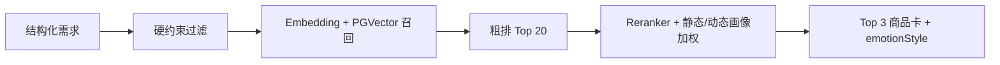

# 语音导购 Agent 架构文档

## 1. 架构总览

### 1.1 业务如何解决

平台在普通商品浏览之外增加语音导购：系统理解用户意图，必要时澄清需求，从商品库中选出 3 个商品，再逐商品生成推荐理由和语音话术。点击与下单行为持续更新画像，影响后续精排；语音下单经过二次确认后创建正式订单。



系统包含三个闭环：语音输入到推荐结果的导购闭环、行为更新画像的个性化闭环、二次确认到正式订单的交易闭环。

### 1.2 LangGraph 核心设计

| 核心部分 | 作用 |
| --- | --- |
| LangGraph | 运行工作流并支持条件路由、状态持久化和多轮恢复 |
| Custom Workflow | 使用代码明确规定 Agent 与业务节点的路径 |
| StateGraph | 定义共享状态、节点、普通边和条件边 |
| LangChain | 封装模型调用、Prompt 和结构化输出 |
| LangSmith | 追踪、调试、评估和监控 Agent 工作流 |

应用代码按 LangGraph 的图装配与节点职责拆分：`agents/graph.py` 只声明节点、边和条件路由；`agents/nodes/intent.py`、`clarification.py`、`recommendation.py`、`response.py` 分别实现业务节点；`agents/nodes/constants.py` 集中维护共享规则；`agents/state.py` 定义图状态和运行时依赖。`workflow.py` 仅保留旧导入路径的兼容导出，新的应用代码直接依赖 `graph.py` 和对应节点模块。

## 2. 业务架构

### 2.1 三端业务能力

| 前端 | 能力 |
| --- | --- |
| 用户端 | 店铺商品浏览、语音导购、我的订单 |
| 商家端 | 店铺 CRUD、商品 CRUD、本店订单 |
| 平台端 | 商家和商品查看、商家启用/禁用、全平台订单 |

三个前端均为独立 Vue 应用，可在同一 Monorepo 中共享组件与 API 类型。

### 2.2 核心业务模块

| 模块 | 职责 |
| --- | --- |
| 商家商品 | 店铺、商品、库存和商家启用状态 |
| 用户画像 | 更新静态/动态画像并生成只读快照 |
| 导购会话 | 保存消息、槽位和工作流状态 |
| Agent 工作流 | 意图识别、需求澄清、商品推荐和情感应答 |
| 合规检查 | 使用正则匹配禁用关键词 |
| 订单 | 待确认订单、正式订单和三端查询 |

## 3. 技术架构

### 3.1 技术与模型选型

后端采用 FastAPI 模块化单体，三个前端使用 Vue。

| 能力 | 选型 |
| --- | --- |
| 工作流/模型封装 | LangGraph、LangChain |
| Agent 可观测性 | LangSmith |
| 数据库/向量检索 | PostgreSQL 15 + PGVector |
| 缓存 | Redis 7 |
| Agent LLM | `qwen3.7-flash` |
| 流式 ASR | `qwen-audio-3.0-asr-flash-streaming` |
| TTS | `qwen-audio-3.0-tts-plus` |
| Embedding | `qwen3.7-text-embedding` |
| Reranker | `qwen3-rerank` |

### 3.2 LangGraph Custom Workflow

Agent 与普通 Python 业务代码均作为 StateGraph 节点。Agent 不直接互调，只读取共享 `ShoppingState` 并返回局部状态更新。



LangGraph 的 PostgreSQL Checkpointer 负责持久化每个节点后的 `ShoppingState`，使工作流能在下一轮继续恢复；本项目使用 `sessionId` 作为 `configurable.thread_id`，并同时作为 LangSmith 的 `metadata.thread_id`。`ShoppingState` 在图中保持扁平键，避免节点更新时覆盖嵌套对象；代码按生命周期拆成当轮输入、跨轮对话、只读 taxonomy、画像候选、推荐、订单和展示输出七组 TypedDict。`session_states` 保存跨轮业务事实：品类、槽位、静态画像候选、商品卡、展示风格和待处理订单；画像只读快照、候选商品、模型开关、历史和回复文本均不作为下一轮输入。

LangSmith 记录整条 StateGraph Trace，并以 `sessionId`、`turnId`、意图和 Agent 节点作为元数据，用于查看节点输入输出、模型调用、延迟、Token 消耗和错误。Trace 只用于可观测与评估，不保存业务状态；用户原话、画像和订单数据写入前需要脱敏。

### 3.3 意图、槽位与 Agent 契约

意图识别输入为当前 `utterance` 和最近 3 轮对话摘要。每轮只选择一个主意图；若用户一句话包含多个请求，按表达顺序选择当前可执行的第一个。每个意图带 `confidence`；推荐意图还需输出标准化 `productCategory`。

```text
PRODUCT_RECOMMENDATION  PRODUCT_ORDER
PRODUCT_COMPARE         PRODUCT_QUERY
CHAT                    UNSUPPORTED_REQUEST
```

`PRODUCT_ORDER` 的 `action` 为 `CREATE/CONFIRM/CANCEL`。商品需求槽位不由意图识别 Agent 输出，而是在需求澄清阶段按品类动态加载和填充。

| 节点 | 输入 | 输出 |
| --- | --- | --- |
| 意图识别 Agent | 当前话语、最近 3 轮摘要 | 意图及置信度、可选订单 action、`productCategory` |
| 需求澄清 Agent | 当前话语、商品品类、该品类 `requiredSlots`、当前槽位、澄清记录 | `ASK/READY`、已更新槽位、缺失槽位、问题 |
| 商品推荐 Agent | 意图、槽位、画像快照、商品事实 | `productCards`、`emotionStyle` |
| 情感应答 Agent | 商品卡、情绪风格、用户原话、会话情绪 | 每个商品的 `productId + reason`、文本增量、`speechText` |

所有结构化输出通过 Pydantic 校验后写入 `ShoppingState`。商品事实由后端提供，Agent 不编造商品 ID、价格、图片和属性；商品卡顺序以加权精排结果为准。

推荐流程首次进入需求澄清节点时，根据二级 `productCategory` 查询该品类固定的 3~5 个 `attributes` Key，这组 Key 同时作为 `requiredSlots`。节点先抽取用户已经表达的槽位，再逐轮询问一到两个缺失项；当 `pendingQuestion` 存在时，下一轮用户回答直接路由回需求澄清节点。全部必填槽位完成后才进入商品推荐 Agent。`budgetMax` 作为跨品类可选过滤条件，不计入品类必填 Key。第一版的品类槽位规则使用应用配置维护，并由数据库约束保证同品类商品 Key 集合一致。

### 3.4 商品推荐与用户画像



```text
matchScore = rerankerScore + ruleAdjustments

ruleAdjustments:
  dynamic.brandAffinity 命中品牌       +0.2
  price > 1.5 × dynamic.avgOrderAmount -0.15
  productId 在 dynamic.recentPurchased -0.3
```

推荐前从 `user_profile_static`、`user_profile_dynamic` 生成只读
`userProfileSnapshot`；同一轮推荐只读取该快照。商品点击和成功订单更新动态画像，
对话中提取的静态资料先写入 `ShoppingState.user_profile_updates`，在订单终态、显式会话关闭
或页面连接断开时统一合并回写 `user_profile_static`。显式渠道字段优先，空值不覆盖已有值。

`PRODUCT_COMPARE` 和 `PRODUCT_QUERY` 同样由商品推荐 Agent 处理，但不重新召回商品。情感应答 Agent 为每张商品卡并发调用一次只生成理由的模型请求；文本增量携带 `productId`，前端据此填入对应卡片。单卡调用失败时只对该卡降级，不影响其他卡片。

### 3.5 语音订单

`PRODUCT_ORDER + CREATE` 创建状态为 `pending` 的订单，有效期 15 分钟；`CONFIRM` 重新校验商家、商品、价格和库存，在事务内扣减库存并更新为 `success`；`CANCEL`、超时或校验失败更新为 `fail`。订单状态仅包含 `pending`、`success`、`fail`，并保存成交快照和幂等键。当前版本不创建支付记录。

### 3.6 核心数据

| 表 | 主要内容 |
| --- | --- |
| `merchants` | 店铺信息和启用状态 |
| `users` | 用户身份和基础信息 |
| `products` | 商家、价格、库存、属性、状态和商品向量 |
| `orders` | 用户、商家、商品、成交快照、金额、15 分钟有效期、状态和幂等键 |
| `user_profile_static` | 用户相对稳定的资料属性 |
| `user_profile_dynamic` | 品类/品牌行为偏好、最近浏览/购买和客单价 |
| `sessions` | 会话基本信息 |
| `session_messages` | 会话消息和轮次 ID |
| `session_states` | `ShoppingState`、画像候选/快照和待确认订单 |

PGVector 字段保存在 `products`；订单成交快照保存在 `orders`。Redis 只保存连接和短期缓存，不保存业务事实。

### 3.7 通信与接口

| 通道 | 数据 |
| --- | --- |
| `/ws/text/{session_id}` | 商品卡、推荐理由/话术增量、完整文本、流程状态 |
| `/ws/audio/{session_id}` | 上行用户录音；下行 TTS 控制消息和二进制音频分片 |
| `POST /api/v1/sessions/{sessionId}/close` | 显式结束会话并收敛静态画像 |

文本连接依次发送 `recommendation.cards`、`text.delta`、`text.completed`。情感应答模型流每完成一个逗号、句号、问号等标点短句，就触发一次 TTS；语音连接即时发送该句的 `audio.start`、二进制音频分片和 `audio.end`，全部短句完成后发送 `audio.done`。ASR 同样按标点短句发送一次 `asr.sentence`，录音提交时发送 `asr.completed`。事件统一包含 `type`、`sessionId`、`turnId`、`seq` 和 `payload`，使用 `sessionId + turnId + seq` 唯一定位并排序。两个连接使用 `sessionId + turnId` 关联并支持重连。

主要 HTTP API：

| 范围 | API |
| --- | --- |
| 用户 | 店铺/商品查询、行为上报、本人订单查询 |
| 商家 | 自有店铺/商品 CRUD、本店订单查询 |
| 平台 | 商家查询与启停、全平台订单查询 |

### 3.8 待确认事项

1. 各商品品类的 `requiredSlots` 具体配置。
2. 静态/动态画像的具体字段和有效期，在 Schema 与表设计阶段确定。
3. Compliance Check 的关键词规则和兜底文本后续确定。
