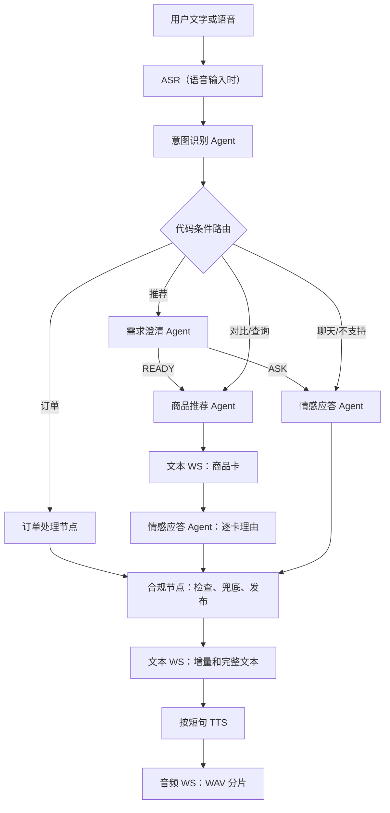

# 语音导购 Agent 需求文档

本文定义语音导购电商 POC 的验证范围、Agent 契约和验证口径。当前代码已经落地的实现约束也在本文中明确，避免需求、架构和实现说明出现不同解释。

## 1. 项目目标

验证一个带语音导购能力的电商平台原型。用户可以浏览店铺和商品，也可以通过文字或语音完成需求澄清、商品推荐、商品查询、商品对比和下单。项目包含用户端、商家端、平台端三个独立前端，以及一个 FastAPI 模块化单体后端。

POC 优先验证以下闭环：

- 用户说出商品需求后，系统能够把自然语言转换为结构化品类和槽位。
- 只有满足品类、预算和已填属性的在售商品才进入推荐结果。
- 推荐结果先展示商品卡，再逐商品生成推荐理由和语音话术。
- 语音下单必须经过待确认订单和二次确认，确认时重新校验价格、库存和可售状态。
- 点击、成功订单和会话中的高置信度资料能够影响后续推荐。

## 2. 三端需求

| 前端 | 功能 |
| --- | --- |
| 用户端 | 启用店铺和在售商品浏览、文字/语音导购、实时商品卡和推荐理由、待确认订单、订单确认/取消、本人订单 |
| 商家端 | 自有店铺 CRUD、商品 CRUD、上下架、价格和库存维护、动态品类槽位建品、本店订单 |
| 平台端 | 一级/二级品类和槽位维护、全量商家和商品查看、商家启用/禁用、全量订单查看、商品向量重建 |

数据可见性和写入边界：

- 用户端只能看到未软删除、`on_sale`、库存大于 0 且所属商家启用的商品。
- 商家只能读写自己名下的店铺、商品和订单；每条商家 SQL 都必须带 owner 约束。
- 平台端可以查看全平台数据，并负责品类及商家治理。
- 店铺和商品删除采用软删除；软删除不会破坏订单成交快照。
- POC 复用既有账号的手机号和密码登录，签发短期 JWT，并按 `customer`、`merchant`、`platform` 角色保护 HTTP 和 WebSocket；业务 SQL 仍执行数据归属校验。

## 3. Agent 需求

| Agent/节点 | 职责 |
| --- | --- |
| 意图识别 Agent | 根据当前话语和最近 3 轮对话识别一个主意图、置信度、订单 action 和标准化二级品类 |
| 需求澄清 Agent | 按当前品类加载必填/选填槽位，抽取、校验并合并槽位；每轮最多追问两个缺失槽位 |
| 商品推荐 Agent | 处理推荐、对比和单品查询，返回商品事实卡、匹配分和情绪风格；不得编造商品事实 |
| 订单处理节点 | 创建、确认或取消订单，并调用订单事务服务完成校验和库存变更 |
| 情感应答 Agent | 为每张商品卡生成一条理由，并将理由组装为完整文本和可播报短句 |
| 合规节点 | 按短句检查推荐理由和话术，命中禁用规则时替换为固定安全回复，并统一发布 |

### 3.1 意图与下单安全

顶层意图固定为 6 类：

```text
PRODUCT_RECOMMENDATION  PRODUCT_ORDER
PRODUCT_COMPARE         PRODUCT_QUERY
CHAT                    UNSUPPORTED_REQUEST
```

规则：

- 每轮只返回一个主意图及其 `confidence`。一句话包含多个请求时，选择最先表达且当前可执行的请求。
- `PRODUCT_ORDER` 使用 `action=CREATE/CONFIRM/CANCEL` 区分订单阶段。
- 推荐、对比和查询只能使用平台当前维护的二级品类；用户未说明且上下文无法确定时不得猜测品类。
- 意图识别提示词必须包含平台当前维护的全部二级品类、每个品类的必填/选填槽位和枚举值。
- 用户已经看到推荐结果后说“买第二款”“买这个”“帮我下单”等，识别为 `PRODUCT_ORDER + CREATE`。
- 只有存在待确认订单且用户明确说“确认/确定”等，才识别为 `PRODUCT_ORDER + CONFIRM`；“下单吧”本身仍是创建待确认订单。
- 没有展示过推荐商品时，不能直接创建订单；新的商品推荐或品类切换会清理旧的需求槽位。

### 3.2 需求澄清与槽位

推荐流程必须先确定商品品类，再从平台品类配置中加载槽位：

1. `requiredSlots` 来源于当前二级品类标记为必填的槽位，缺失时阻塞推荐。
2. `optionalSlots` 可以省略；用户明确填写后同样进入商品硬过滤。
3. 澄清 Agent 先处理用户当前话语和待回答问题，再合并历史槽位；只有通过槽位定义校验的值才可以写入状态。
4. 每轮最多询问一到两个缺失槽位；用户可以只回答其中一个。
5. 所有必填槽位完成后返回 `READY`，进入商品推荐 Agent。
6. `budgetMax` 是跨品类通用的可选预算上限，不计入品类必填槽位。

槽位匹配语义：

- 枚举和布尔值按标准值匹配；商品属性是数组时支持包含匹配。
- 数值槽位表示最低要求，例如续航、压力、水箱、防水和容量采用“商品值大于等于用户要求”。
- 鞋码是用户需要的单个尺码，商品可以使用 `[min, max]` 供给范围；尺码落在范围内即命中。
- 性别需求允许 `unisex` 商品满足男款或女款需求。
- ASR 可能产生同音字或断句错误；模型可以在待回答槽位和候选枚举唯一匹配时纠正，否则必须保留为空并继续询问。

### 3.3 品类和商品建品约束

- 平台端可以独立创建一级分类；创建二级分类时必须关联已存在的一级分类。
- 二级分类创建槽位时必须同时提供非空枚举数组；槽位必须标记必填或选填，不能创建无枚举的裸槽位。
- 商家创建或更新商品时必须选择数据库中已有的二级分类，一级分类由该二级分类的父级确定。
- 必填槽位必须填写非空枚举值；选填槽位可以省略，但填写时同样必须来自枚举。
- 未在当前二级品类定义的属性键不允许写入商品。
- 前端根据槽位定义生成建品控件，API 在写库前再次执行完整校验。

### 3.4 合规要求

推荐理由和完整话术不得包含绝对化、医疗功效、收益承诺或其他业务禁用表达。当前 POC 以正则规则实现：

- 逐商品理由在推送前检查，单卡命中或模型失败时只降级该卡。
- 文本增量推送前检查，不合规增量不得发送。
- 完整话术在工作流末端再次检查；命中时清空理由并使用固定兜底文本。
- 合规检查不调用 LLM，规则命中后不继续使用原话术进行业务展示。

当前实现中，情感应答节点只生成完整话术；`compliance_node` 在一个原子节点内按 TTS 短句边界逐一检查，全部通过后调度文本增量和 TTS，命中禁用规则则先替换为固定安全回复再发布，原始违规话术不会继续发布。

## 4. 语音导购流程



工作流必须由代码条件边决定路径，Agent 不直接调用其他 Agent。前端可以通过 `flow.status` 看到实际运行节点。

## 5. 推荐和用户画像

推荐链路：

1. 过滤未删除、在售、有库存且商家启用的商品。
2. 过滤二级品类、`budgetMax` 和全部已填槽位。
3. 有可用商品向量时使用查询向量做 PGVector 余弦距离召回，最多取 20 条。
4. 使用 Reranker 对候选商品事实精排；模型不可用时使用确定性词法命中分。
5. 在前 3 个候选内叠加用户画像规则，输出 Top 3 商品卡、`matchScore` 和 `scoreBreakdown`。

推荐卡必须只引用后端商品事实，包括商品 ID、商家、SKU、名称、品类、品牌、描述、价格、库存、图片、卖点和属性。推荐 Agent 不生成推荐理由。

`PRODUCT_COMPARE` 和 `PRODUCT_QUERY` 在已有推荐上下文时复用最近商品卡，不重新召回；查询可以根据用户提到的商品名称选择单卡。

画像分为两层：

- 静态画像：性别、年龄、城市、身高、体重、肤质、技术熟练度、预算带和 locale。
- 动态画像：品类/品牌偏好、最近浏览、最近购买、价格敏感度和平均成功订单金额。

点击更新动态画像的增量权重为 `0.1`，成功订单为 `0.32`；最近列表去重并最多保留 20 条。静态资料先保存为会话内候选，在订单进入终态、用户显式关闭会话或页面连接全部断开时合并；显式资料优先，空值和无效值不得覆盖已有资料。推荐开始前只生成本轮只读 `userProfileSnapshot`。

## 6. 语音下单

1. `PRODUCT_ORDER + CREATE`：从最近展示的商品卡中解析商品，创建 `pending` 订单，不扣库存；保存商家/商品成交快照、当前价格、数量、总金额、幂等键，15 分钟有效。
2. `PRODUCT_ORDER + CONFIRM`：锁定订单、商品和商家记录，重新校验有效期、可售状态、商家状态、价格和库存；通过后在同一事务内扣减库存并更新为 `success`。
3. `PRODUCT_ORDER + CANCEL`：只允许用户取消自己的待确认订单，更新为 `fail`，失败原因记录为 `user_cancelled`。
4. 超时、商品下架、商家禁用、价格变化或库存不足都进入 `fail`，并记录失败原因。

订单状态只有 `pending`、`success`、`fail`。终态订单不可重新打开；重复请求按幂等键或当前订单状态返回，不能重复扣库存。POC 不包含支付。

## 7. 通信需求

所有服务端事件统一包含：

```json
{
  "type": "事件类型",
  "sessionId": "会话标识",
  "turnId": "轮次标识",
  "seq": 1,
  "payload": {}
}
```

文本 WebSocket `/ws/text/{session_id}`：

- 上行 `turn.submit`：提交 `turnId` 和 `utterance`；也可带可信资料 `profile`。
- 上行 `session.resume`：带 `turnId` 和 `afterSeq`，请求重放遗漏文本事件。
- 上行 `session.close`：结束会话并合并静态画像。
- 下行 `flow.status`、`recommendation.cards`、`text.delta`、`text.completed`、`order.updated`、`flow.error`。
- `text.delta` 使用 `scope=reason` 和 `productId` 填充对应商品卡，使用 `scope=speech` 填充完整话术。

音频 WebSocket `/ws/audio/{session_id}`：

- 上行 `audio.start`，随后发送 16 kHz PCM16 二进制分片，停止时发送 `audio.commit`；取消时发送 `audio.cancel`。
- 下行 `asr.started`、按标点产生的 `asr.sentence`、最终 `asr.completed` 和 `audio.error`。
- TTS 按短句发送 `audio.start`、WAV 二进制分片、`audio.end`，全部短句完成后发送 `audio.done`；消息中带 `sentenceIndex` 和 `sentenceCount`。
- 文本和音频通过相同的 `sessionId + turnId` 关联；会话和轮次的字符串标识映射为稳定 UUID，便于订单、消息和 LangGraph 关联。

文本事件在内存保留最多 300 条，并写入 Redis 保留 1 小时用于重连重放；音频二进制不进入重放日志，断线后由客户端重新触发语音流程。

## 8. POC 范围和边界

本 POC 验证：三个 Vue 前端、FastAPI HTTP API、六类单意图、动态品类槽位、四类导购 Agent 加订单/合规节点、双 WebSocket、ASR/TTS 适配、PGVector 推荐、用户画像、语音下单、三端订单查询、LangGraph Checkpointer 和可选 LangSmith Trace。

暂不包含：外部身份提供方、refresh token、服务端注销、多设备会话和细粒度权限、支付、退款、物流、售后、真实电商平台对接、复杂画像模型训练、后台异步向量重建任务和生产级限流告警体系。
