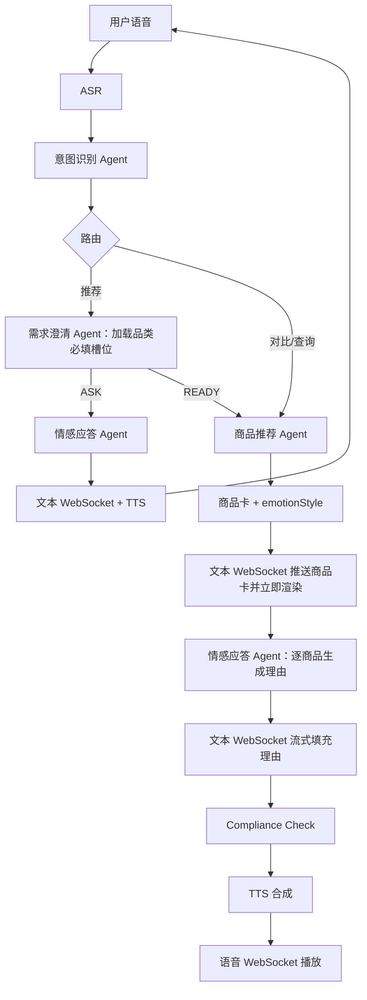

# 语音导购 Agent 需求文档

## 1. 项目目标

建设一个带语音导购能力的电商平台。用户可以浏览店铺和商品，也可以通过语音完成需求澄清、商品推荐和下单。项目包含用户端、商家端、平台端三个独立前端。

## 2. 三端需求

| 前端 | 功能 |
| --- | --- |
| 用户端 | 店铺商品浏览、语音导购、我的订单 |
| 商家端 | 自有店铺 CRUD、自有商品 CRUD、查看本店订单 |
| 平台端 | 查看全部商家和商品、启用/禁用商家、查看全部订单 |

用户只能看到启用商家的可售商品。商家不能访问其他商家的数据；店铺和商品删除采用软删除。

## 3. Agent 需求

| Agent | 职责 |
| --- | --- |
| 意图识别 Agent | 根据用户当前话语和最近 3 轮对话摘要识别意图、置信度和商品品类 |
| 需求澄清 Agent | 根据商品品类加载必填槽位，抽取并补全槽位；每轮询问一到两个缺失项 |
| 商品推荐 Agent | 处理推荐、对比和单品查询，只输出 `productCards` 和 `emotionStyle` |
| 情感应答 Agent | 为每个商品生成一条推荐理由，并生成完整语音话术 |

### 3.1 意图与需求澄清

顶层意图固定为 6 类：

```text
PRODUCT_RECOMMENDATION  PRODUCT_ORDER
PRODUCT_COMPARE         PRODUCT_QUERY
CHAT                    UNSUPPORTED_REQUEST
```

- 每个意图包含 `confidence`，多意图按语义顺序返回。
- `PRODUCT_ORDER` 使用 `action=CREATE/CONFIRM/CANCEL` 区分订单阶段。
- `UNSUPPORTED_REQUEST` 不再细分原因。

用户发起推荐时必须说明要购买的商品品类。意图识别 Agent 输出标准化 `productCategory` 后，需求澄清 Agent：

1. 查询该二级品类的 3~5 个 `attributes` Key；同一品类的商品必须使用完全一致的 Key 集合，这组 Key 同时就是 `requiredSlots`。
2. 从用户当前话语和后续回答中抽取并合并槽位。
3. 存在缺失项时返回 `ASK`，每轮追问一到两个槽位。
4. 所有必填槽位填写完成后返回 `READY`，进入商品推荐 Agent。

`budgetMax` 是跨品类通用的可选过滤条件，不计入品类必填 Key。商品不适用某个 Key 时仍保留该 Key，值可以为 `null`。

### 3.2 合规检查

情感应答的文本增量经过正则关键词过滤后才能推送；完整话术再次通过正则 Compliance Check 后才能提交 TTS。命中规则时停止原话术并使用固定兜底文本，不调用 LLM。

## 4. 语音导购流程



## 5. 推荐与用户画像

- 推荐流程：硬约束过滤 → PGVector 召回 → 粗排 Top 20 → Reranker 与用户画像加权精排 → Top 3。
- 精排权重：Reranker 0.4、动态画像 0.4、静态画像 0.2。
- 静态、动态画像分别保存在 `user_static_profiles`、`user_dynamic_profiles`。
- 商品点击和正式下单都会更新两张画像表，下单权重高于点击。
- 推荐前生成只读 `userProfileSnapshot`，Agent 不直接访问画像表。
- 商品推荐 Agent 不生成理由；情感应答 Agent 为每个商品生成一条理由。

## 6. 语音下单

1. `PRODUCT_ORDER + CREATE`：生成状态为 `pending` 的待确认订单并播报商品、数量、单价和总金额，有效期为 15 分钟。
2. `PRODUCT_ORDER + CONFIRM`：重新校验商家、商品、价格和库存，在事务内扣减库存，并将状态更新为 `success`。
3. `PRODUCT_ORDER + CANCEL`：将订单状态更新为 `fail`；超时或校验失败同样进入 `fail`。

订单状态只有 `pending`、`success`、`fail`。订单保存成交快照并保证幂等；用户、对应商家和平台均可查看。第一版不包含支付。

## 7. 通信需求

- 文本 WebSocket：推送商品卡、推荐理由文本增量、完整文本和流程状态。
- 语音 WebSocket：上行用户录音；下行 TTS 控制消息和二进制音频分片。
- 两个连接使用 `sessionId + turnId` 关联同一轮数据，并支持重连。

## 8. 第一版范围

包含：三个 Vue 前端、四个 Agent、双 WebSocket、个性化推荐、用户画像、语音下单、三端订单查询和 LangSmith 链路追踪。

暂不包含：支付、退款、物流、售后、真实电商平台对接和复杂画像模型训练。
